# Diagrams

Every figure here is generated, not drawn. `scripts/diagrams/` builds the SVGs
and the Mermaid; `make diagrams` regenerates all of them. Two consequences
worth stating:

* **The state machines cannot drift from the design.** They are rendered from
  `tb/models/tables.py`, the independent transcription that
  `test_protocol_l1_table.py` and `test_protocol_dir_table.py` compare the RTL
  to, cell by cell. If the RTL and that table disagree, those tests fail. So a
  state machine that is wrong is a state machine that could not have been
  generated.
* **The block diagrams are hand-placed on purpose.** Placement carries meaning
  in a microarchitecture drawing — the MSHR file belongs on a particular side
  of the pipeline — and a force-directed layout will happily put it on the
  wrong one. What auto-layout *is* good at, state machines and dependency
  graphs, is Mermaid.

Each figure is meant to state an argument, not to label boxes: the bug it
prevents, the decision that chose it, and what that choice cost.

### Why generated, and not draw.io

draw.io was the obvious choice and is the wrong one here. A drawing tool stores
the *picture*; a reviewer then has to take on trust that the picture still
matches the RTL. Ten figures across a design that changed under twenty-one
bugs would have drifted, and silently. Generating them means a figure is a
function of the design: the state machines come from the checked protocol
table, the sizing numbers come from `coh_pkg.sv`, and `make diagrams` is in the
same Makefile as `make lint`.

The cost is real and worth naming: hand-placed SVG is slower to author than
dragging boxes, and there is no WYSIWYG loop — the loop here was render to PNG
and look at it. For a one-off slide, draw.io wins. For a figure that has to
stay true for as long as the RTL does, it does not.

The output is ordinary SVG, so if you do want to edit one by hand, draw.io
imports it (File -> Import) and so does Inkscape. Just expect the next
`make diagrams` to overwrite it.

---

## 1. The system

### Topology

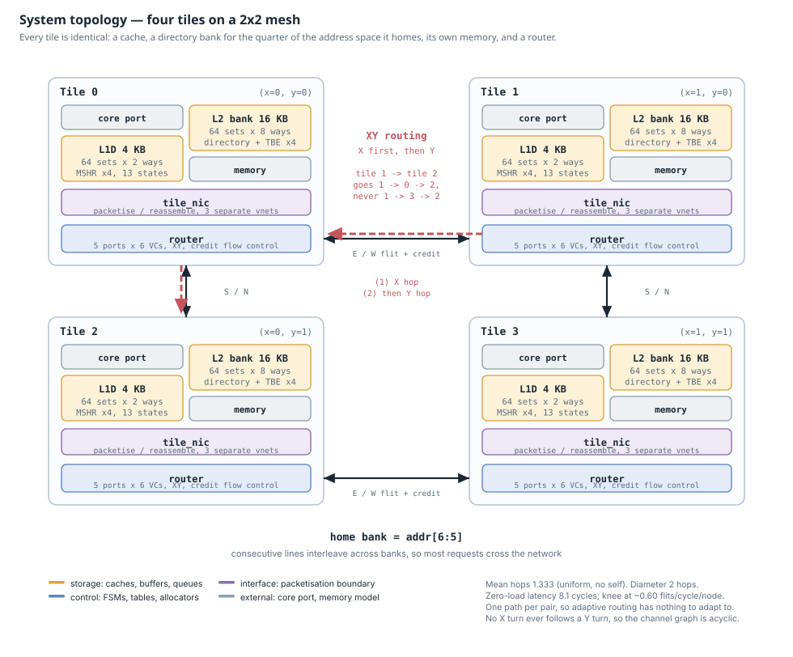

Four tiles, each with a cache, a directory bank, its own memory and a router.
Mean hops 1.333, diameter 2, one path per pair — which is why there is nothing
for adaptive routing to adapt to. See `docs/noc_perf.md` for the measured
latency curve and where the knee is.

### Address decode

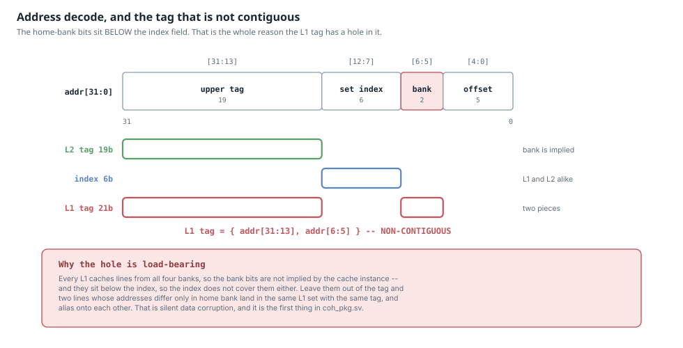

The one figure to read before any of the RTL. The home-bank bits sit *below*
the index field, which is why the L1 tag is not contiguous. Leave the bank bits
out of the tag and two lines that differ only in home bank alias onto each
other in the same L1 set — silent data corruption, and the first thing in
`coh_pkg.sv`.

### Packet and flit format

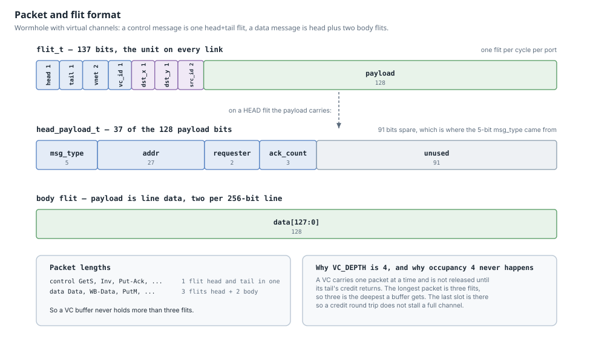

137-bit flits; a control message is one head+tail flit, a data message is head
plus two body flits. The longest packet being three flits is what makes
`VC_DEPTH = 4` enough, and makes buffer occupancy 4 unreachable by
construction — one of the coverage exclusions that has an argument rather than
a waiver.

---

## 2. The tile

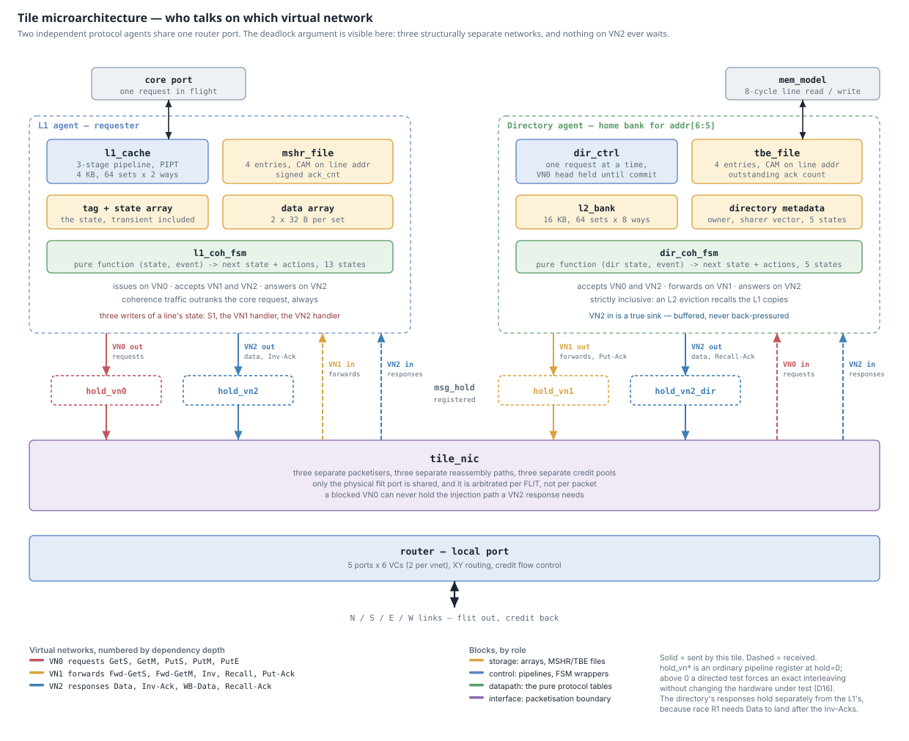

Two independent protocol agents — a requesting L1 and a home directory bank —
sharing one router port. The deadlock argument is physically visible: three
structurally separate networks, separate packetisers, separate credit pools,
and only the flit port shared, arbitrated per flit.

---

## 3. The L1 cache

### Pipeline, and the order work is let in

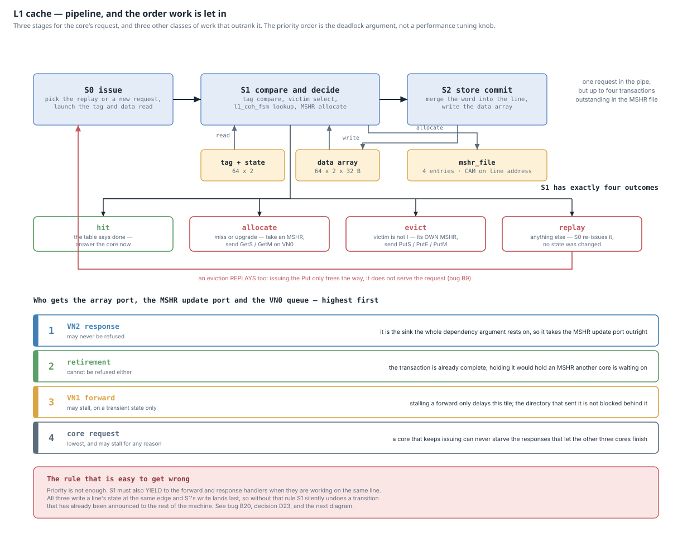

Three stages for the core's request and three classes of coherence work that
outrank it. The priority order is part of the deadlock argument, not a
performance knob: a core that keeps issuing must never be able to starve the
responses that let the other three cores finish.

### Three writers of one line's state

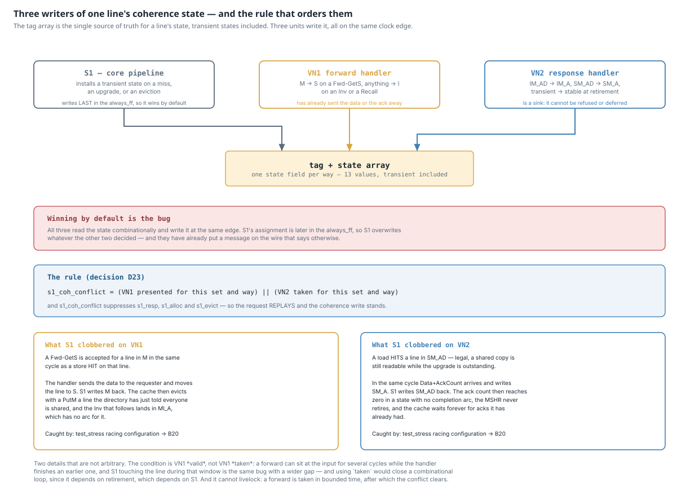

The tag array is the single source of truth for a line's coherence state,
transient states included — and three units write it on the same clock edge.
S1's write lands last in the `always_ff`, so without an explicit rule S1 wins
by default and silently undoes a transition that has already been announced to
the rest of the machine. This is bug B20 and decision D23.

### The 13 stable and transient states

Thirteen states and thirty-three arcs on one canvas is a picture of a mess, so
the machine is drawn in the two halves the states themselves already form. A
transient is either waiting for a line to arrive or waiting for permission to
let one go, and none is ever both. The four stable states appear in both
halves, because that is where the halves meet — and the generator fails if any
arc in the table lands in neither.

**Getting a line** — `I`, `S`, `E`, `M`, and the five transients that wait for
data or for acks.

<!-- BEGIN l1-fsm-fetch -->
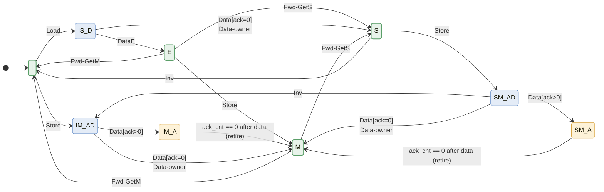
<!-- END l1-fsm-fetch -->

**Giving a line up** — the four transients that wait for a Put-Ack. Each one
remembers what the line was when the eviction started, because a forward that
arrives meanwhile still has to be answered correctly: `MI_A` owes data, `SI_A`
owes only an ack, and `II_A` owes nothing but still has to wait.

<!-- BEGIN l1-fsm-evict -->
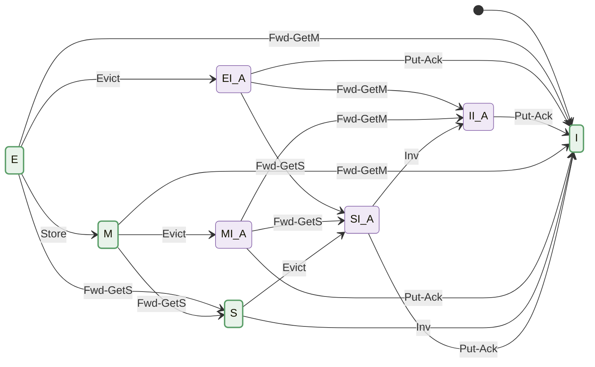
<!-- END l1-fsm-evict -->

Self-loops are left off so the shape is readable. What a transient state
*absorbs* without moving is just as load-bearing as what moves it, so it is
tabulated instead:

<!-- BEGIN l1-stalls -->
| transient state | stalls on | no arc at all |
| --- | --- | --- |
| `IS_D` | Load, Store, Evict, Fwd-GetS, Fwd-GetM, Inv | Put-Ack, Data[ack>0], Inv-Ack |
| `IM_AD` | Load, Store, Evict, Fwd-GetS, Fwd-GetM, Inv | Put-Ack, DataE |
| `IM_A` | Load, Store, Evict, Fwd-GetS, Fwd-GetM, Inv | Put-Ack, DataE, Data[ack=0], Data[ack>0], Data-owner |
| `SM_AD` | Store, Evict, Fwd-GetS, Fwd-GetM | Put-Ack, DataE |
| `SM_A` | Store, Evict, Fwd-GetS, Fwd-GetM | Inv, Put-Ack, DataE, Data[ack=0], Data[ack>0], Data-owner |
| `MI_A` | Load, Store, Evict | Inv, DataE, Data[ack=0], Data[ack>0], Data-owner, Inv-Ack |
| `EI_A` | Load, Store, Evict | Inv, DataE, Data[ack=0], Data[ack>0], Data-owner, Inv-Ack |
| `SI_A` | Load, Store, Evict | Fwd-GetS, Fwd-GetM, DataE, Data[ack=0], Data[ack>0], Data-owner, Inv-Ack |
| `II_A` | Load, Store, Evict | Fwd-GetS, Fwd-GetM, Inv, DataE, Data[ack=0], Data[ack>0], Data-owner, Inv-Ack |
<!-- END l1-stalls -->

"No arc at all" means the table cell is blank and the RTL raises `illegal`.
Those blanks are checked exhaustively — a blank that is silently absorbed is
the failure mode `a_no_illegal_event` exists to catch, and it is how bug B19
surfaced.

---

## 4. The directory

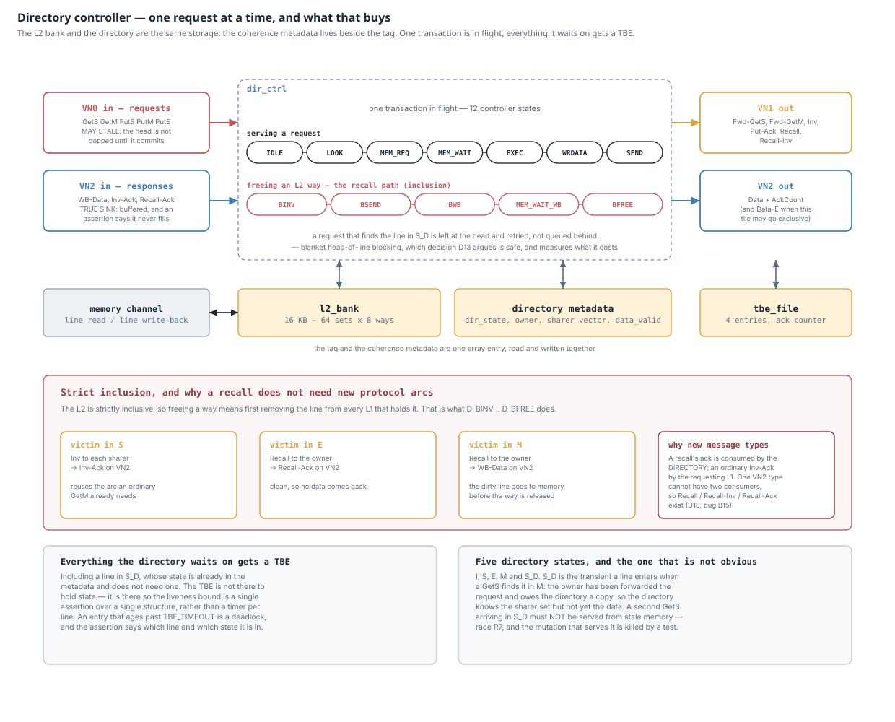

One transaction in flight, a TBE for everything it waits on, and strict
inclusion — which means freeing an L2 way first means recalling the line from
every L1 that holds it.

### The five directory states

<!-- BEGIN dir-fsm -->
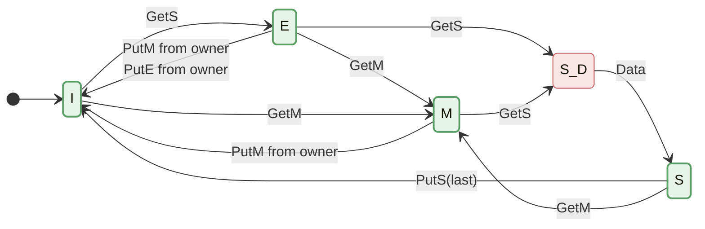
<!-- END dir-fsm -->

`S_D` is the one that is not obvious: the transient a line enters when a GetS
finds it in `M`. The owner has been forwarded the request and owes the
directory a copy, so the directory knows the sharer set but not yet the data. A
second GetS arriving in `S_D` must not be served from stale memory — that is
race R7, and the mutation that serves it is killed by a named test.

The diagram is drawn with `ENABLE_E = 1`. With `ENABLE_E = 0` exactly one arc
changes — `I --GetS--> E` becomes `I --GetS--> S` — which is the whole
difference between MESI and MSI in this design, and is why both are built and
tested from the same RTL.

---

## 5. The network

### Router

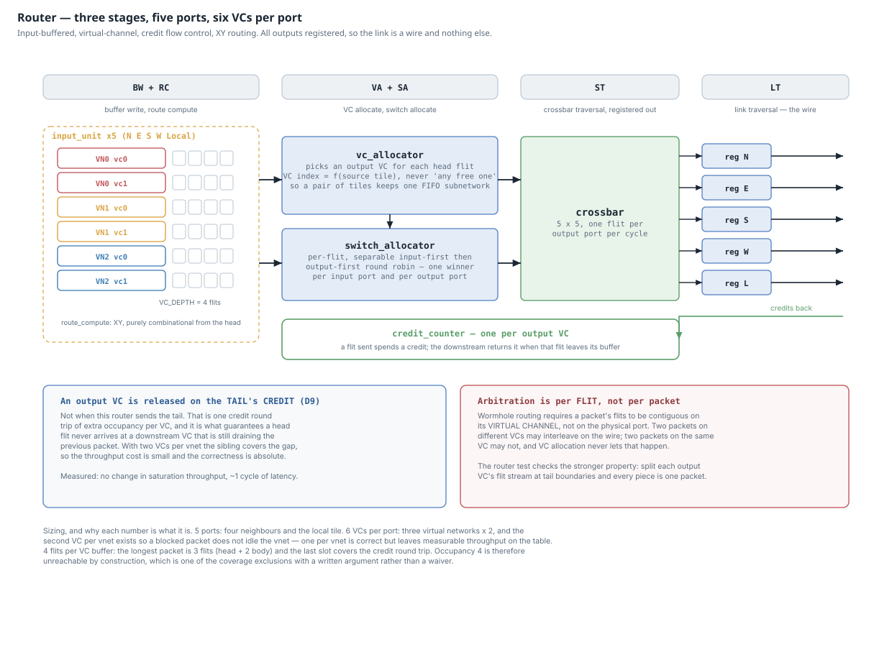

Three stages, five ports, six VCs per port. Every sizing number has a reason
written beside it.

### The three virtual networks

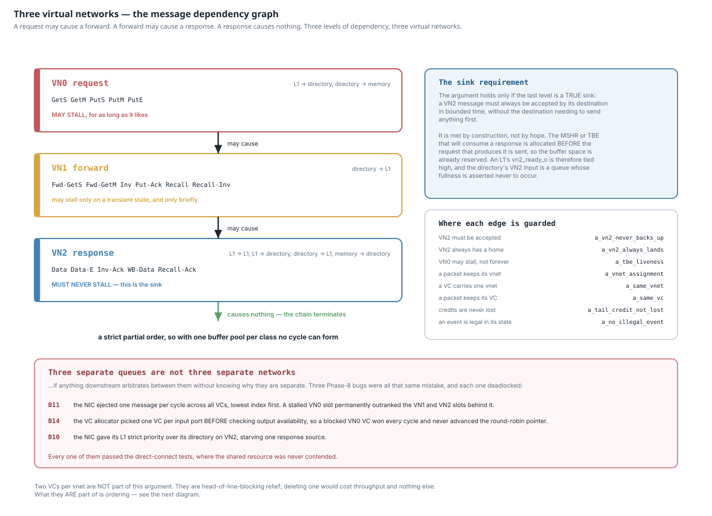

A request may cause a forward; a forward may cause a response; a response
causes nothing. Three levels of dependency, three virtual networks — and the
argument holds only because the last level is a true sink, which is met by
construction rather than by hope.

### Point-to-point ordering

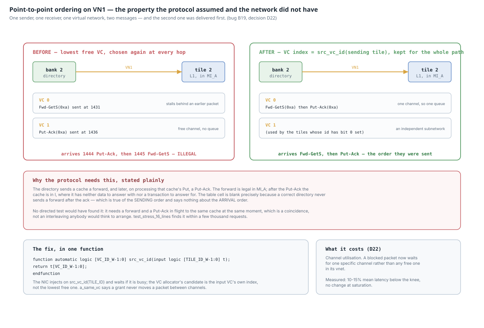

The protocol requires forwards and Put-Acks between one pair of tiles to arrive
in the order they were sent. The network did not provide that, and no directed
test would have found it. This is bug B19 and decision D22, with the trace that
localised it.

---

## 6. Verification

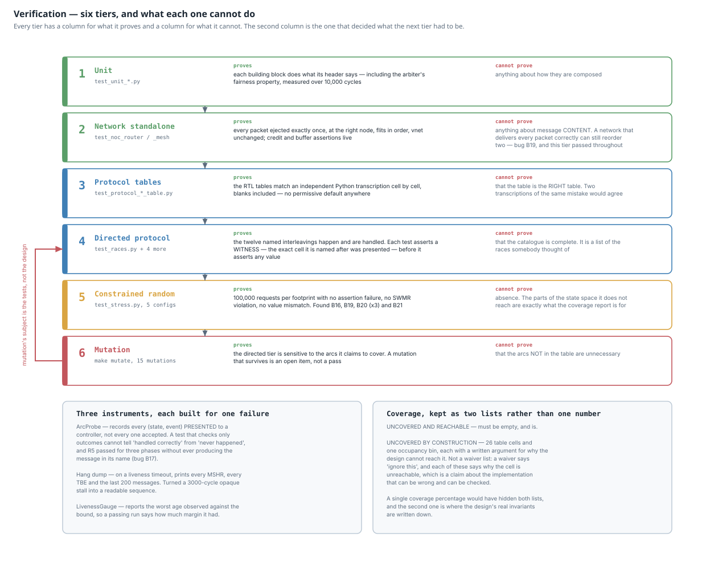

Six tiers, and for each one a column for what it proves and a column for what
it cannot. The second column is the one that decided what the next tier had to
be — tier 2 passing throughout the life of bug B19 is not a footnote, it is the
reason tier 5 exists.

Note the loop at the left: tier 6's subject is the tests, not the design.
`docs/verification.md` has the full version, including the coverage lists and
an honest account of what is not verified at all.

---

## Regenerating

```sh
make diagrams
```

Requires `python3` only for the SVGs. The Mermaid blocks in this file are
rewritten in place between their `<!-- BEGIN ... -->` markers.
