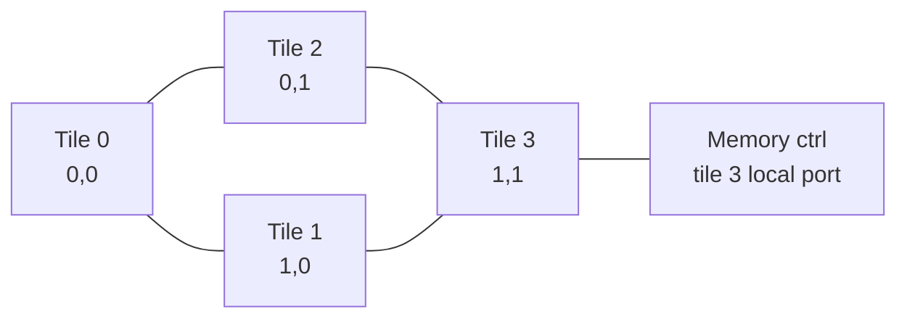
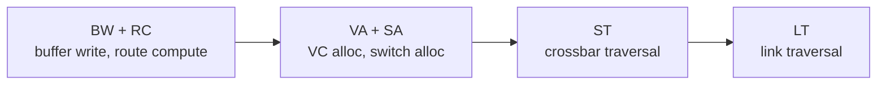

# The design, as built

This is the build specification, annotated wherever the implementation
departed from it. Every departure is marked inline like this:

> **DEVIATION.** What changed, and why.

The specification's own preamble and phase plan are kept so the document reads
as one thing; they describe how the design was built, not what it is. For what
it is, `docs/READING_ORDER.md` is the faster route.

## Deviations at a glance

| # | Section | Deviation | Why |
| --- | --- | --- | --- |
| 1 | System | Memory is per tile, not one controller at tile 3 | the hot spot it was meant to create is better made by the address footprint, and a distributed memory keeps the NoC measurements about coherence traffic |
| 2 | Address map | The L1 tag is `{addr[31:13], addr[6:5]}`, not `addr[31:7]` | the bank bits sit BELOW the index field, so without them two lines differing only in home bank alias |
| 3 | Messages | `msg_type` is 5 bits, not 4 | 23 encodings are in use; a 4-bit field had no headroom for the recall types |
| 4 | Messages | Back-invalidation uses three types, not one | a recall's ack must be distinguishable from an Inv-Ack at the network interface (D18) |
| 5 | Directory | VN0 stalls head-of-line whenever ANY TBE is live | the per-line stall the spec preferred was conditional on Phase 6 landing clean, and it did not (D13) |
| 6 | NoC | A packet keeps its virtual channel for its whole path | the protocol needs point-to-point ordering on the forward network and did not have it (B19, D22) |
| 7 | SVA | There is no `SINK_BOUND` | the sink property is structural -- `vn2_ready_o` is tied high -- so there is no window to bound |
| 8 | SVA | Liveness bounds are module parameters, raised by the stress tier | raising a bound and re-running is how a deadlock is told apart from a slow path (D20, D24) |
| 9 | Verification | Coverage splits uncovered bins into reachable and by-construction | 26 legal cells are foreclosed by the microarchitecture; each carries a written argument rather than being excluded |
| 10 | Verification | A fifth stress configuration lifts per-line exclusivity | it is the only way the transient-state forward arcs are reachable, and it found the worst bug in the project |
| 11 | Repo layout | No `req_gen.sv`; cocotb drives the core ports directly | the stimulus belongs in the same process as the scoreboard that checks it |

---

# Directory MESI + NoC — Claude Code Build Spec

## How to use this, and the rules of engagement

Save this file into the repo root as `SPEC.md`, then open Claude Code there and paste the block below as your first message. Everything after this section is the spec it reads.

```
Read SPEC.md end to end before writing a line. It is the complete design
specification for a directory-based MESI coherence subsystem over a 2x2 mesh NoC,
in synthesizable SystemVerilog, verified with Verilator + cocotb.

Build it by the phase plan at the end of SPEC.md. Do not skip a gate. At each gate,
stop, run the tests, paste the real output, and wait for me.

Non-negotiables:
- Never stub, comment out, xfail, loosen, or delete a test to make a phase pass.
  If a test fails the RTL is wrong; fix the RTL. If you think the test is wrong,
  stop and say why, and wait.
- Never paper over a race with timing hacks: no extra settle cycles in the
  testbench, no sleeps, no arbitrary delays. Fix the protocol.
- Every bug you find goes in docs/bug_log.md: symptom -> how you localized it ->
  root cause stated in protocol/microarchitecture terms -> fix -> the test that
  now catches it. One entry per bug, readable by a third party.
- Every non-obvious decision goes in docs/decisions.md: decision -> alternatives
  considered -> why this one -> what it costs. Write these as arguments, not
  descriptions. I have to defend them under questioning.
- If the spec is ambiguous or you think a choice in it is wrong, stop and ask.
  Do not silently substitute something else.
- No `initial`, no `#delay`, no `force`/`release` anywhere under rtl/.
- Commit at every gate with a message naming the phase and what it proves.

Start with Phase 0.
```

One thing this cannot do for you: bring-up. Run the sims yourself, read every module top to bottom, and break things deliberately — flip a directory transition, drop an Inv-Ack, shrink a VC to one flit — to watch the assertions fire. The debug stories are what gets probed, and they only exist if you were the one at the waveform.

## Goal, scope, constraints

Build a synthesizable 4-tile shared-memory subsystem: private MSHR-backed L1 data caches, an inclusive shared L2 sliced into 4 address-interleaved banks that also hold the directory, a MESI protocol with the full transient-state set, and a 2x2 mesh NoC with XY routing, 3 virtual networks, VCs and credit flow control. Verified with a cocotb reference model, directed race tests, and SWMR/data-value assertions.

In scope: coherence and interconnect RTL, a synthetic memory-request generator per tile, a behavioral main-memory model, full verification.

Out of scope: a real core, MMU/TLB, instruction cache, atomics beyond what is listed, memory consistency model enforcement beyond coherence (no fences, no store buffer), physical design, multi-word sectoring.

Hard constraints:

1. Everything under `rtl/` is synthesizable SystemVerilog-2017 — synchronous logic, one clock, no multi-driver nets, no latches. Arrays are behavioral SRAM wrappers in `rtl/lib/` with a clean read/write port contract so they could be swapped for a compiled macro.
2. Reset is asynchronous assert, synchronous de-assert, generated once in the top and fanned out; every flop that needs it takes `rst_n`.
3. All module outputs are registered unless the port is explicitly named combinational in the spec. Every ready/valid pair obeys: `valid` may not depend combinationally on `ready` in the same direction; backpressure is handled with skid buffers where a cut is required.
4. `always_ff` uses non-blocking only; `always_comb` uses blocking only and default-assigns every output at the top of the block.
5. Nothing is allowed to deadlock. The protocol-level deadlock argument in the virtual-network section is a correctness requirement, not commentary, and an assertion must back each of its claims.
6. Parameters live in one package. No magic numbers in RTL.
7. Zero Verilator lint warnings with `-Wall`, no waivers except a documented list in `lint/waivers.vlt` with a one-line justification each.

Success criterion: a 4-core constrained-random stress run over a 16-line address footprint, 100k requests, passes the coherence checker and every SVA with zero stalls-to-deadlock, and each named race in the race catalogue has a directed test that fails if the corresponding protocol arc is removed.

## System, parameters, address map

Four identical tiles on a 2x2 mesh. Every tile holds a request generator, an L1D, an L2/directory bank, a network interface, and a router. Placing an L2 bank in every tile is deliberate: it makes the home node a function of the address, so most requests actually traverse the network, and it is the organization real tiled manycores use.



Tile *n* sits at mesh coordinate `(x,y) = (n[0], n[1])`. The main-memory model hangs off tile 3's L2 bank; every bank reaches memory over VN0/VN2 to tile 3, which is a deliberate hot spot to exercise the network.

> **DEVIATION 1.** Every tile has its own `mem_model`, reached directly by its
> own directory bank. A fill never crosses the network, and `MEM_TILE_ID` was
> deleted.
>
> The single controller was there to create a hot spot. It does create one, but
> it creates it on *every* miss, which buries coherence traffic under fill
> traffic and makes the network measurements a story about memory bandwidth.
> The hot spots that matter are easier to make deliberately -- the stress
> tier's L2-pressure configuration homes every line at one bank, and race R12
> does the same -- and those are hot spots in the *coherence* traffic, which is
> what this design is about.
>
> The cost is worth stating plainly: memory latency never includes a network
> traversal here, so miss latencies are lower than a real tiled machine's, and
> one class of contention -- fills competing with forwards for the same links
> -- is not exercised at all.

| Parameter | Value | Note |
| --- | --- | --- |
| `NUM_TILES` | 4 | 2x2 mesh |
| `ADDR_W` | 32 | physical byte address |
| `LINE_BYTES` | 32 | 256-bit line |
| `WORD_W` | 32 | request granularity, with byte enables |
| `L1_SETS` / `L1_WAYS` | 64 / 2 | 4 KB, PIPT, write-back write-allocate |
| `L2_SETS` / `L2_WAYS` | 64 / 8 | 16 KB per bank, 64 KB total, inclusive |
| `MSHR_ENTRIES` | 4 per L1 | fully associative on address |
| `NUM_VNETS` | 3 | see message set |
| `VCS_PER_VNET` | 2 | 6 VCs per port |
| `VC_DEPTH` | 4 flits | per VC |
| `FLIT_PAYLOAD_W` | 128 | 2 data flits per line |
| `MEM_LATENCY` | 20 cycles, programmable | behavioral model |

Address decode, from LSB: `[4:0]` block offset, `[6:5]` home bank ID, `[12:7]` L1 index, `[31:7]` L1 tag.

> **DEVIATION 2.** The L1 tag is `{addr[31:13], addr[6:5]}` -- 21 bits, and
> **not contiguous**.
>
> `[31:7]` as written overlaps the index field, which cannot be right. The
> non-obvious part is the other end: the bank bits `[6:5]` sit *below* the
> index, so they are neither covered by the index nor implied by the cache
> instance -- every L1 sees all four banks. Leave them out of the tag and two
> lines whose addresses differ only in home bank land in the same L1 set with
> the same tag and alias onto each other, which is silent data corruption.
> This is the first thing in `coh_pkg.sv` and the first thing in the reading
> order. Putting the bank ID immediately above the offset interleaves consecutive lines across banks; document the alternative (bank bits above the index) and why it was rejected.

The L1 index plus offset is 13 bits, which exceeds a 4 KB page offset, so note honestly in `docs/decisions.md`: this L1 is **physically indexed** and no virtual aliasing question arises. If asked about VIPT, the sizing rule is index+offset ≤ page offset, which at 4 KB pages and 32 B lines caps a VIPT L1 at 128 sets × line size before you need either higher associativity or page coloring. Do not claim VIPT in the RTL.

Each tile's request generator is a simple FSM driven by a cocotb-writable command FIFO: `{op (LD/ST/EVICT_HINT), addr, wdata, byte_enable, tag}` in, `{tag, rdata}` out. It must support back-to-back issue to different addresses and a configurable outstanding limit so the MSHR file can be filled and drained under test.

## L1 cache and MSHR file

`l1_cache` is a 3-stage non-blocking pipeline. S0 issues the tag and data array reads and the MSHR CAM lookup. S1 compares tags, resolves hit/miss against the coherence state, and either returns data or allocates an MSHR. S2 writes the data array on a store hit or a fill. Tag and data arrays are read in parallel (a 2-way L1 is small enough that way-late selection buys nothing at this scale — say so in the decisions doc, and name the alternative for a larger cache).

Per line the tag array holds `{valid, tag, coh_state[3:0], dirty}`. Dirty is redundant with M but keep it explicit so the E-to-M silent upgrade is visible in one place.

The request FSM must handle four classes of work and arbitrate between them with this fixed priority, highest first:

1. **Coherence messages from the network** (Inv, Fwd-GetS, Fwd-GetM, Put-Ack, Data). These can never be backpressured to the point of blocking a response virtual network. Responses in particular must always be sinkable.
2. **Fill completion** from an MSHR whose ack count has reached zero.
3. **Replacement** / writeback issue.
4. **New core request.**

Giving coherence messages priority over new core requests is what makes the deadlock argument hold; write down why.

### MSHR entry

| Field | Width | Purpose |
| --- | --- | --- |
| `valid` | 1 | entry in use |
| `addr` | `ADDR_W-5` | line address, CAM-compared |
| `state` | 4 | the transient coherence state (IS^D, IM^AD, ...) |
| `ack_cnt` | signed 4 | outstanding Inv-Acks; **must be signed** |
| `data` | 256 | fill buffer |
| `wdata` / `be` | 32 / 4 | the store held pending, if any |
| `core_tag` | 4 | returned to the request generator |
| `victim_way` | 1 | way chosen at allocation |
| `needs_wb` | 1 | victim was M and its writeback is pending |
| `fwd_pend` | 3 | a forward arrived while transient and was deferred |

`ack_cnt` is signed because Inv-Acks can arrive before the Data message that carries the AckCount. In IM^AD each early Inv-Ack decrements and the entry stays in IM^AD; when Data[ack=N] lands, `ack_cnt += N`, and zero means done. This is the single most-likely-to-be-asked detail in the whole design. Implement it exactly this way and add an assertion that `ack_cnt` never goes positive after Data has been received more than once.

Rules: one MSHR per line address, enforced by CAM — a second core request to a line with a live MSHR stalls in S1 rather than merging, and an assertion fires if two valid entries share an address. MSHR full stalls new core requests only, never network input. Allocation must reserve the victim way at the same time so a fill can never find its way stolen.

Replacement is pseudo-LRU over 2 ways (one bit per set). A victim in M issues PutM with data, in E issues PutE without data, in S issues PutS; the MSHR stays live through `MI^A` / `EI^A` / `SI^A` until Put-Ack. Silent eviction of E is **not** allowed here — E is an ownership state in this protocol, and the reason is that the directory cannot otherwise know whether the owner silently upgraded to M.

## L2 bank, directory, inclusion

Each bank is the home for the quarter of the address space selected by `addr[6:5]`, and is both the last-level cache and the directory. Directory metadata lives beside the L2 tag, one entry per L2 line, which is the whole point of an inclusive L2: no separate directory storage, and no directory entry can exist for a line the L2 does not hold.

Per-line metadata: `{valid, tag, dir_state[2:0], sharers[3:0], owner[1:0], data_valid}`. `sharers` is a full bit vector. `data_valid` distinguishes an L2 line whose data is stale because an owner holds it dirty.

Full-vector sharer tracking costs 4 bits here and `NUM_TILES` bits in general — write the scaling argument into the decisions doc along with the two standard alternatives (limited pointers with a broadcast fallback; coarse vectors over node groups) and which one you would pick at 64 tiles and why.

### Pipeline and serialization

The directory controller processes one request per line at a time. Requests arrive on VN0, are looked up, and either act immediately or allocate a **transaction buffer entry (TBE)** for the cases that must wait: `S^D` waiting for the owner's data after a Fwd-GetS, and the back-invalidation sequence. A request that hits a line with a live TBE **stalls at the head of the VN0 input queue**.

That stall is the single most dangerous thing in the design. It is only safe because VN0 stalling can never block VN1 or VN2, and every TBE is waiting on a VN2 message that is guaranteed to arrive. Assert both: a TBE may not live longer than `TBE_TIMEOUT` cycles (parameterized, default 500), and a VN0 head-of-line stall may not exceed the same bound. Also implement per-line stall rather than blanket queue stall if you can do it cleanly; if you cannot, document that head-of-line blocking at the directory is the known throughput cost of the simple design.

> **DEVIATION 5.** The directory stalls VN0 head-of-line whenever **any** TBE
> is live, not only for the line the TBE covers -- the "blanket queue stall"
> this paragraph allows as the fallback.
>
> Per-line was conditional on Phase 6 landing clean. It did not: bugs B7
> through B9 were all in the directory's single-transaction path, and adding a
> second concurrent transaction before that path was trusted would have made
> them harder to find, not easier. The cost is throughput -- a bank blocked on
> one line blocks every line it homes -- and it is measured rather than
> assumed; see D13.

### Inclusion and back-invalidation

The L2 is strictly inclusive. When an L2 set has no free way and needs one, the victim's sharers must be evicted from their L1s first:

1. Allocate a TBE in state `INV_PEND`, record the sharer vector (or owner).
2. Send `Inv` to every sharer on VN1, or `Fwd-GetM`-style recall to the owner if `dir_state` is M or E.
3. Collect Inv-Acks (and the recalled dirty data) on VN2, decrementing a count.
4. Write dirty data back to memory, free the way, then replay the request that triggered the eviction.

A back-invalidation that lands on an L1 line in M is the interesting case: the L1 in M receiving `Inv` must send data, not a bare ack. Decide and document whether you use `Inv` plus a data-carrying ack, or a separate `Recall`/`Fwd-GetM` from the directory to itself — the second is cleaner and reuses existing arcs. The eviction victim must not be chosen from a line with a live TBE; assert it.

This interaction — capacity pressure in a shared cache silently destroying a private cache's dirty line — is the thing worth being able to explain cold, including why an exclusive or non-inclusive LLC trades this problem for needing a separate directory structure.

## MESI cache controller

Thirteen states: four stable (I, S, E, M) and nine transient. Superscripts follow the Sorin/Hill/Wood primer: `A` means waiting for acks, `D` means waiting for data.

| State | Meaning |
| --- | --- |
| `IS_D` | had I, issued GetS, awaiting data |
| `IM_AD` | had I, issued GetM, awaiting data and acks |
| `IM_A` | data arrived, acks outstanding |
| `SM_AD` | had S, issued GetM (upgrade), awaiting data/AckCount and acks |
| `SM_A` | AckCount known, acks outstanding |
| `MI_A` | issued PutM, awaiting Put-Ack |
| `EI_A` | issued PutE, awaiting Put-Ack |
| `SI_A` | issued PutS, awaiting Put-Ack |
| `II_A` | was evicting, got invalidated mid-flight, awaiting Put-Ack |

Implement this table literally. Blank means the event cannot occur and must trigger an `$error` assertion — do not write a permissive default.

| State | Load | Store | Evict | Fwd-GetS | Fwd-GetM | Inv | Put-Ack | DataE from dir | Data dir[ack=0] | Data dir[ack>0] | Data from owner | Inv-Ack |
| --- | --- | --- | --- | --- | --- | --- | --- | --- | --- | --- | --- | --- |
| I | GetS → `IS_D` | GetM → `IM_AD` | — | — | — | — | — | — | — | — | — | — |
| `IS_D` | stall | stall | stall | stall | stall | stall | — | → E | → S | — | → S | — |
| `IM_AD` | stall | stall | stall | stall | stall | stall | — | — | → M | → `IM_A` | → M | `ack--`, stay |
| `IM_A` | stall | stall | stall | stall | stall | stall | — | — | — | — | — | `ack--`; if 0 → M |
| S | hit | GetM → `SM_AD` | PutS → `SI_A` | — | — | Inv-Ack to req, → I | — | — | — | — | — | — |
| `SM_AD` | hit | stall | stall | stall | stall | Inv-Ack to req, → `IM_AD` | — | — | → M | → `SM_A` | → M | `ack--`, stay |
| `SM_A` | hit | stall | stall | stall | stall | — | — | — | — | — | — | `ack--`; if 0 → M |
| E | hit | hit, → M (silent) | PutE → `EI_A` | Data to req **and dir**, → S | Data to req, → I | — | — | — | — | — | — | — |
| M | hit | hit | PutM+data → `MI_A` | Data to req **and dir**, → S | Data to req, → I | — | — | — | — | — | — | — |
| `MI_A` | stall | stall | stall | Data to req+dir, → `SI_A` | Data to req, → `II_A` | — | → I | — | — | — | — | — |
| `EI_A` | stall | stall | stall | Data to req+dir, → `SI_A` | Data to req, → `II_A` | — | → I | — | — | — | — | — |
| `SI_A` | stall | stall | stall | — | — | Inv-Ack to req, → `II_A` | → I | — | — | — | — | — |
| `II_A` | stall | stall | stall | — | — | — | → I | — | — | — | — | — |

Four details that carry the design, each of which needs a comment in the RTL and a paragraph in `docs/decisions.md`:

- **`E` on Fwd-GetS sends data to the requester *and* the directory.** The directory cannot tell whether the owner silently upgraded E→M, so it must be refreshed unconditionally. This is why `S^D` exists at the directory.
- **`SM_AD` on Inv sends an Inv-Ack and falls to `IM_AD`.** The core lost its shared copy to somebody else's GetM before its own upgrade was ordered. It must ack (or that core deadlocks) and must now expect full data, not just an AckCount.
- **`IM_AD` on Inv-Ack decrements and stays.** Acks are racing ahead of the data. The counter must be signed.
- **`MI_A` on Fwd-GetM goes to `II_A`, not I.** The PutM is still in flight and its Put-Ack is still owed; retiring the MSHR early leaves a message with no destination state.

Stall means: leave the message at the head of its input queue and re-evaluate next cycle. Stalls are only ever applied to VN0 and VN1 inputs, never VN2.

## Directory controller

Five states: I, S, E, M, and `S_D` (had M or E, forwarded a GetS, waiting for the owner's writeback data before it can serve anyone else).

| State | GetS | GetM | PutS (not last) | PutS (last) | PutM from owner | PutM from non-owner | PutE from owner | PutE from non-owner | Data |
| --- | --- | --- | --- | --- | --- | --- | --- | --- | --- |
| I | DataE to req, owner=req, → E | Data to req, owner=req, → M | Put-Ack | Put-Ack | — | Put-Ack | — | Put-Ack | — |
| S | Data to req, add req to sharers | Data+AckCount to req, Inv to other sharers, clear sharers, owner=req, → M | remove req, Put-Ack | remove req, Put-Ack, → I | — | remove req, Put-Ack | — | remove req, Put-Ack | — |
| E | Fwd-GetS to owner, sharers={owner,req}, clear owner, → `S_D` | Fwd-GetM to owner, owner=req, → M | Put-Ack | Put-Ack | copy data to L2, Put-Ack, clear owner, → I | Put-Ack | Put-Ack, clear owner, → I | Put-Ack | — |
| M | Fwd-GetS to owner, sharers={owner,req}, clear owner, → `S_D` | Fwd-GetM to owner, owner=req | Put-Ack | Put-Ack | copy data to L2, Put-Ack, clear owner, → I | Put-Ack | Put-Ack | Put-Ack | — |
| `S_D` | **stall** | **stall** | remove req, Put-Ack | remove req, Put-Ack | remove req, Put-Ack | remove req, Put-Ack | remove req, Put-Ack | remove req, Put-Ack | copy data to L2, → S |

Notes that must appear as RTL comments:

- **`I` on GetS returns DataE and goes to E, not S.** That is the entire point of adding E: read-then-write costs one transaction instead of two. It is also why a PutE transaction has to exist.
- **`S` on GetM sends Data plus the AckCount even when the requester is already a sharer.** This is the primer's simplification: the requester in `SM_AD` already has valid data, so a bare AckCount would do. Implement the simple version, and be ready to say that the optimized version saves a line of network data per upgrade and costs a new message type plus a distinct `SM_A` entry arc.
- **`E`/`M` on PutS is a stale PutS.** A sharer evicted, then the line went to M/E via another core before the PutS arrived. Ack it and change nothing.
- **PutE from non-owner while in E** happens when core A evicts E, the directory reassigns E to core B, and A's PutE arrives after. Ack it, do not clear the owner. Getting the owner-check right here is the difference between a working protocol and silent data loss.
- **`S_D` stalls GetS and GetM but accepts every Put.** Stalling the Puts too would deadlock: the cache that owes you the data may itself be waiting on a Put-Ack.

The directory is also a cache controller toward memory. On a miss in the bank (L2 tag miss), it fetches from the memory model before responding, holding a TBE across the fetch. On eviction of a clean L2 line with no sharers, it drops it silently; dirty goes back to memory.

## Messages, virtual networks, packet format

> **DEVIATION 3 and 4.** `msg_type` is 5 bits. The full set is 23 encodings,
> which does not fit in 4, and the head flit uses 37 of 128 payload bits so the
> extra bit is free.
>
> Back-invalidation uses three message types rather than reusing `Inv`:
> `Recall` to an owner, `Recall-Inv` to a sharer, and `Recall-Ack` for the
> reply. The first two still map onto the existing `Fwd-GetM` and `Inv` arcs at
> the cache, exactly as this specification asks -- no new state, no new column.
> The third is the one the specification did not anticipate: a tile hosts both
> a cache and a directory bank, the network interface decides which of them a
> response is for from its type alone, and an ordinary `Inv-Ack` answers a
> cache while a recall's ack answers a bank. One type with two possible
> consumers is bug B15; see D18.

Three virtual networks, assigned by dependency depth rather than by who sends them.

| VNet | Class | Messages | Src → Dst |
| --- | --- | --- | --- |
| VN0 | Request | GetS, GetM, PutS, PutM+data, PutE | L1 → directory; directory → memory |
| VN1 | Forward / Intervention | Fwd-GetS, Fwd-GetM, Inv, Put-Ack | directory → L1 |
| VN2 | Response | Data (dir), DataE, Data (owner), Inv-Ack, WB-Data | L1 → L1, L1 → directory, directory → L1, memory → directory |

### Why exactly three, and why this order

A request can cause a forward. A forward can cause a response. A response causes nothing. That is a strict partial order, so if each class has its own buffer pool no cycle can form in the message-dependency graph. Three levels of dependency means three virtual networks — not three because there are three kinds of node.

The argument only holds if the last level is a true sink. That gives a hard requirement: **a VN2 message must always be accepted by its destination in bounded time, without the destination needing to send anything first.** In practice that means the MSHR or TBE that will consume the response was allocated before the request was sent, so buffer space for the response is already reserved. Enforce it with an assertion: a VN2 flit at a local ejection port may never be backpressured for more than `SINK_BOUND` cycles (default 8, and that slack only exists for arbitration).

VN0 may stall arbitrarily (head-of-line at the directory). VN1 may stall on a transient L1 state. VN2 may never stall. Every stall arc in the two state tables must be checked against this rule, and Claude Code should produce `docs/deadlock.md` walking the dependency graph explicitly and listing which assertion guards each edge.

The two VCs inside each VNet are for head-of-line blocking relief only, not for deadlock freedom. Be ready to state that distinction; it is a standard follow-up.

### Packet and flit format

Wormhole with VCs. Control packets are a single head+tail flit. Data packets are head + 2 body/tail flits (256-bit line over a 128-bit payload).

```
flit_t:
  head          1      first flit of packet
  tail          1      last flit of packet
  vnet          2      0..2
  vc_id         1      which VC within the vnet
  dst_x, dst_y  1,1    mesh coordinates, used by route compute
  src_id        2      originating tile
  payload     128

head-flit payload layout (control):
  msg_type      4
  addr         27      line address
  requester     2      for forwards: who to respond to
  ack_count     3      for Data from directory
  reserved
```

Route computation reads only `dst_x`/`dst_y` from the head flit; body flits inherit the VC and output port latched at the head. Assert that a VC never interleaves flits of two packets, and that every packet that starts eventually ends (no orphaned head).

## NoC: router, routing, flow control

Five-port router (N, E, S, W, Local), input-buffered, 6 VCs per input port (3 VNets × 2 VCs), 4 flits per VC.

### Pipeline

Three stages, all outputs registered:



Route compute runs on the head flit only, at buffer-write time, and the result is stored in the VC's state. VC allocation is head-only; body flits inherit. Switch allocation runs every cycle for every flit with a granted output VC and a non-zero downstream credit.

Per-input-VC state: `{state (I/R/V/A), out_port, out_vc, credit_count}` where I=idle, R=routing done, V=output VC granted, A=active.

### Routing

Dimension-ordered XY: route in X to `dst_x`, then in Y. Deadlock-free by construction because it forbids two of the four turns, so the channel dependency graph is acyclic. Put the turn-model argument in `docs/deadlock.md` and say explicitly what XY costs: zero path diversity, so a hot spot cannot be routed around. Name the alternatives rejected (O1TURN, west-first, fully adaptive with an escape VC) and the cost of each.

### Allocators

Separable input-first, two round-robin stages:

> **DEVIATION 6.** A packet keeps the virtual channel it was injected on for
> its whole path, and that channel is a function of the sending tile. It does
> not arbitrate for "a free VC within its vnet"; it waits for its own.
>
> The rule as written reorders: two messages from one directory to one cache
> can take different channels and arrive out of order, and the coherence
> protocol cannot survive that -- a Put-Ack overtaking a forward retires the
> cache's transaction, and the forward then lands in `I`, where the table is
> blank and there is no data left to answer with. That is bug B19, found by the
> constrained-random tier after every directed test had passed. Keeping the
> channel makes each VC index an independent XY-routed subnetwork: still
> deadlock-free, and FIFO between any pair of tiles that share it. See D22.

- VC allocation: each input VC requesting an output port arbitrates for a free output VC **within its own VNet** — a packet may never change VNet, and an assertion must enforce it. Stage 1 picks one winning request per input port; stage 2 picks one winner per output VC.
- Switch allocation: stage 1 picks one VC per input port, stage 2 picks one input per output port.

Round-robin arbiters use the mask/priority-rotate style: the pointer advances only when a grant is taken, and holds — does not rotate — on a cycle with no request. Write one parameterized `rr_arbiter` and instantiate it everywhere; no hand-rolled variants.

### Credit flow control

One credit counter per downstream VC, initialized to `VC_DEPTH`. Decrement on flit send, increment on credit return. Credit return fires when the flit is read out of the downstream buffer; note in the docs the optimization of firing as soon as departure is certain.

Assertions that matter: a credit counter never goes negative, never exceeds `VC_DEPTH`, and no flit is sent to a VC with zero credits. Add an independent buffer-overflow check on the receive side — if both are correct they are redundant, which is precisely why you want both.

State this correctly in the docs, because it is a common trap: buffer depth ≥ bandwidth × credit round-trip latency is a **throughput** condition, not a correctness one. One buffer per VC suffices for correctness; too few buffers just idles the link while credits return. Compute the actual round trip for this router (send → downstream buffer write → credit generate → credit link → counter update) and state whether `VC_DEPTH=4` covers it or how much throughput is left on the table.

### Network interface

`tile_nic` packetizes L1 and directory messages into flits and depacketizes on eject. It owns VNet assignment and destination-tile computation (home bank from `addr[6:5]`, requester ID from the message). It must present independent ready/valid per VNet in both directions so a blocked VN0 cannot stall VN2 — this is where the deadlock argument is physically implemented, so keep the three paths structurally separate rather than sharing one queue.

## Race catalogue

Each race below gets a named directed test in `tb/tests/test_races.py` that drives the exact interleaving through a deterministic network-delay hook, plus a mutation check: temporarily delete the protocol arc that handles it and confirm the test fails. Record the mutation result in `docs/races.md`. A race with a test that still passes after the arc is removed is not being tested.

| # | Race | Interleaving | Arc that handles it |
| --- | --- | --- | --- |
| R1 | Early Inv-Ack | Core A in `IM_AD`; Inv-Acks from sharers arrive before Data+AckCount from the directory | signed `ack_cnt`, `IM_AD` + Inv-Ack decrements and stays |
| R2 | Upgrade loses the race | Core A in S issues GetM; core B's GetM is ordered first; Inv reaches A while in `SM_AD` | `SM_AD` + Inv → Inv-Ack, → `IM_AD` |
| R3 | Writeback vs forward | Core A in `MI_A` (PutM in flight); directory, still seeing A as owner, sends Fwd-GetM | `MI_A` + Fwd-GetM → Data to req, → `II_A`; directory PutM-from-non-owner |
| R4 | Stale PutS | Sharer evicts (PutS); line goes to M at another core before the PutS lands | dir M/E + PutS → Put-Ack, no state change |
| R5 | PutE from non-owner | A evicts E, directory grants E to B, A's PutE arrives late | dir E + PutE(not owner) → Put-Ack, owner untouched |
| R6 | Two GetMs back to back | B and C both GetM the same line; directory serializes | dir M + GetM → Fwd-GetM to current owner, owner=req |
| R7 | GetS into `S_D` | Directory in `S_D` awaiting the owner's data; a third core's GetS arrives | dir `S_D` stalls GetS/GetM, accepts all Puts |
| R8 | Fwd into a dead MSHR | Fwd-GetS arrives for a line whose MSHR is in `II_A` | `II_A` treats it as impossible — assert; if it fires, the directory sent a forward after Put-Ack, which is a directory bug |
| R9 | Back-invalidation hits M | L2 capacity eviction recalls a line an L1 holds in M | recall path returns dirty data; L2 writes it to memory before freeing the way |
| R10 | False sharing storm | Four cores store to four distinct words of one line, round-robin | no protocol arc — this is the performance test; measure transactions per store and show the line ping-pongs |
| R11 | Silent E→M then eviction | A gets E, silently upgrades to M, evicts with PutM+data while directory still records E | dir E + PutM(owner) → copy data, → I |
| R12 | Credit starvation | One VC held by a blocked packet while another VNet is saturated | no forward progress loss; VN2 must still drain |

R8 deserves special treatment. Rather than adding a permissive arc, assert that it cannot happen and then reason about why: the directory removes the requester from the sharer list before sending Put-Ack, so no forward can be generated for it afterward. If the assertion ever fires during stress, that is a real directory ordering bug, not a missing cache arc. Write that reasoning down; the instinct to add a state instead of proving the case impossible is exactly what a good interviewer will test.

The deterministic delay hook: `tb/models/net_delay.py` lets a test pin per-VNet, per-source-destination-pair latencies so that, for example, VN2 from tile 1 is 3 cycles and VN1 from tile 3 is 30. Every race above must be reachable by configuring that hook, without touching RTL.

## Verification

Verilator in `--binary --trace --assert` mode driven by cocotb. Icarus as a secondary target for SVA-light smoke runs.

### Reference model

`tb/models/golden.py` is an atomic, sequentially-consistent memory: a dict of line address → 256-bit value, plus a per-core view. It never models transient states. Every completed L1 request is checked against it at retirement. This works because coherence, unlike consistency, has a simple sequential specification — say so in the docs, and be clear that this testbench does *not* verify a memory consistency model, only coherence.

`tb/models/coherence_checker.py` is a separate monitor that snoops every L1's state array (via hierarchical reference or a debug port) each cycle and enforces the two invariants directly:

- **SWMR.** For every line, at every cycle, either exactly one core is in M or E, or zero cores are in M/E and any number are in S. Never both.
- **Data value.** The value read at the start of a core's epoch equals the value written by the last core to hold the line in M before it.

SWMR checked on the *implementation's* state array is stronger than checking it on observed loads and stores, and it localizes bugs to the cycle they occur rather than the cycle they become visible. Prefer a small debug bus over hierarchical references so the check survives synthesis-style elaboration.

### SVA

In `rtl/` guarded by `` `ifndef SYNTHESIS ``, or in bound checker modules under `tb/sva/`:

- one-hot / legal-value check on every coherence state register
- illegal transition: `$error` on any state/event pair the tables mark impossible
- `ack_cnt` reaches exactly zero, never undershoots past zero after Data
- MSHR address uniqueness
- no L2 eviction of a line with a live TBE
- credit counter bounds; no send on zero credits; no VC buffer overflow
- no packet changes VNet; no VC interleaves two packets; every head gets a tail
- liveness bound: every allocated MSHR retires within `MSHR_TIMEOUT` (default 1000 cycles); every TBE within `TBE_TIMEOUT`
- ~~a VN2 flit is never backpressured at a local ejection port beyond `SINK_BOUND`~~

> **DEVIATION 7.** There is no `SINK_BOUND`, and the parameter was deleted.
>
> The sink property is structural here rather than bounded: an L1's
> `vn2_ready_o` is tied high, and the directory's VN2 input queue carries an
> assertion that it never fills. There is no window to put a bound on, and a
> bound would be a weaker statement of something already proved.

> **DEVIATION 8.** `MSHR_TIMEOUT` and `TBE_TIMEOUT` are module parameters, and
> the constrained-random tier builds with them raised.
>
> Raising a bound and re-running is the only way to tell a deadlock from a slow
> path, and it is how bug B14 was settled -- worst TBE age 8000 before the fix,
> 54 after. The stress tier injects holds of up to 200 cycles to reach the
> stale-Put races, under which a transaction legitimately lives 600-900 cycles,
> so it raises the bounds to match and prints the worst age it observed against
> them on every run. The defaults are validated where no long holds are
> injected -- race R12 measures 315 against 1000 and 212 against 500. See D20
> and D24.

> Two assertions were **added** rather than deviated from: no packet changes
> virtual channel (`a_same_vc`), and the L2's copy is current whenever the
> directory records a line as I or S (`a_l2_copy_current`). Both are invariants
> that bugs B19 and B21 violated, and both are checked where they are
> established rather than where they are used.


The liveness bounds are the deadlock detector. They must be real assertions that fire, not testbench watchdogs that print a warning.

### Test tiers

1. **Unit.** `rr_arbiter`, credit counter, VC buffer, crossbar, route compute, skid buffer — each with its own cocotb test and randomized stimulus.
2. **Network standalone.** `noc_top` with traffic generators at each local port: uniform random, tornado, all-to-one hot spot. Check every injected packet is ejected exactly once, at the right destination, with flits in order, and report latency vs offered load. Plot a load-latency curve into `docs/noc_perf.md`; the knee is a number worth being able to quote.
3. **Single tile.** L1 + directory with no network (direct connect), then with the network.
4. **Directed protocol.** One test per row of both state tables that is reachable, plus the twelve races.
5. **Constrained random.** 4 cores, configurable address footprint (4, 16, 256 lines), mix of LD/ST/evict, randomized per-VNet delays, 100k requests. Small footprints force conflict and back-invalidation; large ones exercise capacity paths.
6. **Mutation.** A `make mutate` target that applies a list of single-line RTL mutations (drop an Inv-Ack, skip the `S_D` stall, make `ack_cnt` unsigned, remove the owner check on PutE) and confirms a named test fails for each. This is what proves the test suite has teeth.

### Coverage

> **DEVIATION 9 and 10.** The coverage report splits uncovered bins into
> **reachable** (an open item; this list is empty) and **uncovered by
> construction** (26 cells and one occupancy bin). Each of the second group
> carries a written argument in `tb/models/coverage.py` and is printed in the
> report rather than filtered out of the legal set, because a cell there is a
> claim about the implementation and claims should be arguable.
>
> There are five stress configurations, not three. The two extra ones are the
> ones that found bugs: an L2-capacity configuration that puts more lines in an
> L2 set than the L2 has ways, so back-invalidation runs continuously; and a
> racing configuration that lifts the testbench's per-line exclusivity. The
> second is the important one -- with one operation per line a forward can
> never meet a miss on the same line, so the entire left half of the race
> catalogue is unreachable by construction from a random test. Bug B16 lived
> through ten thousand random requests for exactly that reason, and B20 was
> found only by the racing run.

Functional covergroups in Python: cross of (L1 state × event), cross of (dir state × event), MSHR occupancy 0..4, VC occupancy 0..4, number of sharers 0..4, and a cover for each named race. Report uncovered legal bins at the end of a stress run and treat a non-empty list as an open item, not a pass.

## Repo layout and conventions

```
rtl/
  pkg/coh_pkg.sv            params, state enums, message enums, flit_t
  lib/rr_arbiter.sv         parameterized round-robin
  lib/skid_buffer.sv        ready/valid cut
  lib/fifo.sv               sync FIFO, credit-friendly
  lib/sram_1rw.sv           behavioral array wrapper
  lib/credit_counter.sv
  l1/l1_cache.sv            3-stage pipeline, tag+data arrays
  l1/l1_coh_fsm.sv          the 13-state table
  l1/mshr_file.sv           CAM + entries
  l2/l2_bank.sv             data+tag arrays, memory interface
  l2/dir_ctrl.sv            the 5-state table
  l2/tbe_file.sv
  noc/router.sv
  noc/input_unit.sv         per-port VC buffers + state
  noc/route_compute.sv      XY
  noc/vc_allocator.sv
  noc/switch_allocator.sv
  noc/crossbar.sv
  noc/noc_top.sv            2x2 mesh wiring
  tile/tile_nic.sv          packetize/depacketize
  tile/req_gen.sv           synthetic core        <-- DEVIATION 11, see below
  tile/tile_top.sv
  top/system_top.sv         4 tiles + memory model
  mem/mem_model.sv          behavioral, parameterized latency
tb/
  models/golden.py  coherence_checker.py  net_delay.py  scoreboard.py
  tests/            test_unit_*.py test_noc_*.py test_protocol_*.py
                    test_races.py test_stress.py
  sva/              bound checker modules
sim/     Makefile, verilator config, waves/
lint/    waivers.vlt
docs/    spec.md decisions.md races.md deadlock.md bug_log.md
         verification.md noc_perf.md interview_notes.md
```

> **DEVIATION 11.** There is no `rtl/tile/req_gen.sv`. Each tile's core
> request and response channels are ports on `system_top`, driven directly by
> cocotb.
>
> The specification's request generator is an RTL FSM fed by a
> cocotb-writable command FIFO, which is one more piece of hardware to get
> right and one more place for a testbench bug to look like a design bug. With
> the ports exposed, the stimulus lives in the same process as the scoreboard
> that checks it, which is what makes the driver able to say "this response
> has no predicted value" for a racing operation -- see
> `tb/models/multicore.py`. The ports are an ordinary ready/valid interface
> with a tag, so a `req_gen` could be dropped in later without changing
> anything below it.
>
> Two smaller notes on this layout: the scoreboard is in
> `tb/models/multicore.py` rather than a separate `scoreboard.py`, because it
> and the driver share the per-line exclusivity invariant that makes the
> golden model's answer well defined and splitting them would split that
> argument; and `tb/sva/` does not exist, because the specification's other
> option was taken -- every assertion is in `rtl/` under
> `` `ifndef SYNTHESIS ``, next to the logic it constrains.

Conventions Claude Code must follow without exception:

- `always_ff @(posedge clk or negedge rst_n)`, non-blocking only. `always_comb`, blocking only, every output default-assigned on the first lines of the block.
- One `typedef enum logic [N-1:0]` per state machine in `coh_pkg.sv`, with an explicit `default: begin ... $error(...) end` in every case statement. No `unique case` without a default.
- Bit widths always written `[N-1:0]`, never `[N-1]`. Lint must catch this; add a check.
- Module port lists: `clk`, `rst_n`, then inputs grouped by interface, then outputs. ANSI style. No `.*` connections.
- Ready/valid: `valid` stable until `ready`, payload stable while `valid && !ready`, no combinational path from `ready` back to `valid` within a module. Use `skid_buffer` where a cut is needed.
- Arrays: never a bare `logic [N-1:0] mem [D]` in a controller. Instantiate `sram_1rw` so the port contract (one-cycle read latency, no read-during-write forwarding) is explicit and the pipeline is designed around it.
- Every file starts with a header comment: what it does, its interfaces, and the one non-obvious thing about it.
- `make lint` (Verilator `-Wall`), `make test`, `make test TEST=<name>`, `make waves TEST=<name>`, `make mutate`, `make all`. `make all` must pass from a clean clone.
- Git: one commit per phase gate, message naming the phase and what it proves. No squashing the history — the commit log is part of the story.

## Phase plan

Build bottom-up. Each gate stops and waits. Never start phase N+1 with a failing test in phase N.

| Phase | Build | Gate |
| --- | --- | --- |
| 0 | Repo skeleton, `coh_pkg.sv` with every parameter, state enum and message enum, Makefile, lint clean on an empty top | `make lint` and `make test` run and report zero tests, cleanly |
| 1 | `rr_arbiter`, `fifo`, `skid_buffer`, `credit_counter`, `sram_1rw` | unit tests pass; arbiter fairness measured over 10k cycles and reported |
| 2 | Router: input unit, route compute, allocators, crossbar; single router standalone | all 5×5 turns exercised; credit and buffer assertions active; no flit loss or reorder |
| 3 | `noc_top` 2x2 mesh + traffic generators | uniform, tornado and hot-spot traffic; every packet ejected once at the right node; load-latency curve in `docs/noc_perf.md` |
| 4 | `l1_cache` with a blocking, coherence-free path to a single memory | loads and stores hit and miss correctly against `golden.py`; writeback of dirty victims works |
| 5 | `mshr_file` + non-blocking L1, still no coherence | 4 outstanding misses; MSHR-full stalls; no address duplication |
| 6 | `dir_ctrl` + `l2_bank`, MSI only (drop E), directly connected to L1s, no network | MSI directed tests per table row; SWMR checker active; 10k random requests pass |
| 7 | Add E: DataE on GetS from I, silent E→M, PutE, `S_D` data-to-directory | full MESI table; R5 and R11 pass |
| 8 | Wire the L1s and directories through `tile_nic` and `noc_top` | everything from phase 7 passes over the network; VNet assignment assertion active |
| 9 | Inclusion and back-invalidation | R9 passes; L2 capacity pressure test with a footprint that forces eviction of lines held in M |
| 10 | Race catalogue: `net_delay.py` hook, all twelve directed tests | each race passes; each mutation of its handling arc makes it fail; `docs/races.md` records both |
| 11 | Constrained random stress, coverage, `make mutate` | 100k requests × 3 footprints, zero assertion failures, coverage report with an empty uncovered-legal-bin list |
| 12 | Documentation pass | every doc file complete; `make all` from a clean clone |

Two things to get right about ordering. MSI before MESI (phase 6 before 7) means the hard transient-state debugging happens in a protocol with four fewer arcs, and the E-state bugs are then isolated. Direct-connect before network (phase 6–7 before 8) means a protocol bug is never confused with a network bug — when something breaks in phase 8, the protocol is already known good, so the network is the suspect. Both of those are worth saying out loud if asked how you approached bring-up.

If a phase gate fails twice in a row for the same reason, stop and escalate rather than trying a third variation.

## Documentation deliverables

The docs are not an afterthought — they are the part that survives into an interview. Claude Code writes them as it goes, not at the end.

| File | Content |
| --- | --- |
| `docs/spec.md` | this document, updated wherever the implementation deviated, with the deviation and its reason called out |
| `docs/decisions.md` | every non-obvious choice as decision → alternatives → why → cost. Minimum entries: bank interleaving bits, inclusive vs exclusive L2, full-vector vs limited-pointer directory, E as an ownership state, 3 VNets, XY vs adaptive, VC count and depth, separable allocator, PIPT vs VIPT, MSHR no-merge policy, directory head-of-line stall |
| `docs/deadlock.md` | the message-dependency graph, why 3 VNets suffice, which assertion guards each edge, and the separate routing-deadlock argument for XY |
| `docs/races.md` | the twelve races, each with the interleaving as a sequence diagram, the handling arc, the test name, and the mutation result |
| `docs/bug_log.md` | every bug: symptom → localization → root cause → fix → the test that catches it now |
| `docs/verification.md` | the tiers, what each proves, coverage summary, and an honest list of what is *not* verified (consistency model, multi-word atomics, ECC, power) |
| `docs/noc_perf.md` | load-latency curve, saturation point, average hops, and the effect of VC count on the knee |
| `docs/interview_notes.md` | a 90-second spoken overview, then the ten questions you would ask about this design with the answers |

For `docs/interview_notes.md` specifically, the ten questions should be the ones that are genuinely hard, not a glossary. Suggested starting set: why three virtual networks and not two or four; why `ack_cnt` must be signed; what breaks if `S_D` accepts a GetS; why E must send data to the directory on a Fwd-GetS; what happens when an L2 back-invalidation hits a line in M; why the credit depth rule is about throughput and not correctness; what XY costs and when you would pay for adaptive routing; how the directory serializes two simultaneous GetMs and what that implies for fairness; how this scales to 64 tiles and what breaks first; and how you would verify the memory consistency model, which this testbench does not.

A final instruction for Claude Code: at the end of phase 12, produce a short `docs/READING_ORDER.md` listing the modules in the order a person should read them to understand the design, with one line each on what to look for. That file is for the human, and it is the one that makes the rest of this usable.

---

## Beyond the specification: phases 13 and 14

> **ADDITION.** Neither phase is in the document above. Both were asked for
> after phase 12 closed, and both are recorded here so that the phase list and
> the repository still describe the same project.

| Phase | Deliverable | Gate |
| --- | --- | --- |
| 13 | Diagrams and a README that leads with them | every figure generated by `make diagrams`; the two state machines rendered from `tb/models/tables.py`, the transcription the RTL is already checked against, so a figure that disagrees with the design cannot be produced |
| 14 | Synthesis collateral | a complete Design Compiler flow in `syn/`, PDK-agnostic; `make lint-synth`, `make lint-synth-bb` and `make -C syn dryrun` all clean and all inside `make lint` |

Two things about phase 14 are worth stating in the same place as the rest of
the spec, because they are the kind of claim a reader should be suspicious of.

**`dc_shell` has never run this flow.** There is no Synopsys tool and no PDK on
the machine this was built on. `syn/README.md` says that in its first
paragraph, and `docs/verification.md` lists frequency, area and gate count as
unknown. The three checks that do run are front-end checks and a tool-stubbed
dry run; decision D26 is precise about what they buy and what they do not.

**The arrays are black boxes by default.** A flop-based area number for a 4 KB
L1 and a 16 KB L2 is an artefact of the behavioural model rather than a fact
about the design — see decision D25 — so the flow reports the control logic's
area and path, and says so in the report list.
